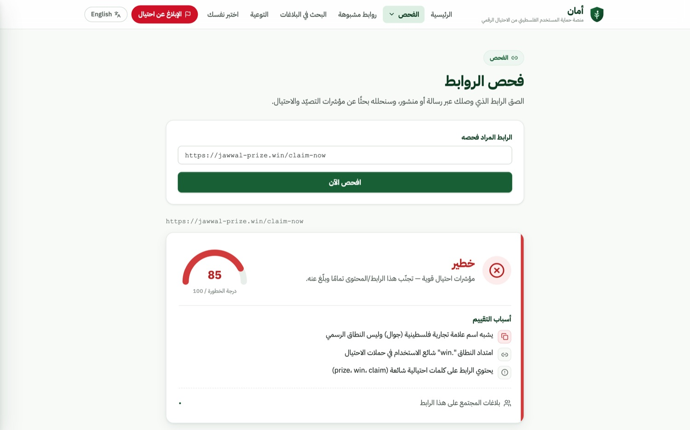
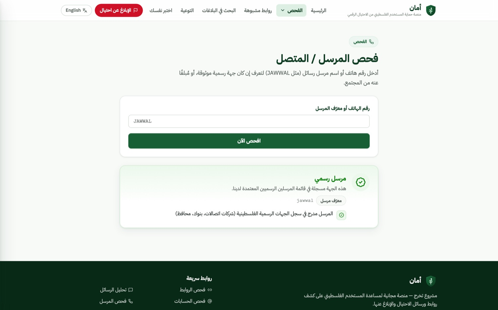
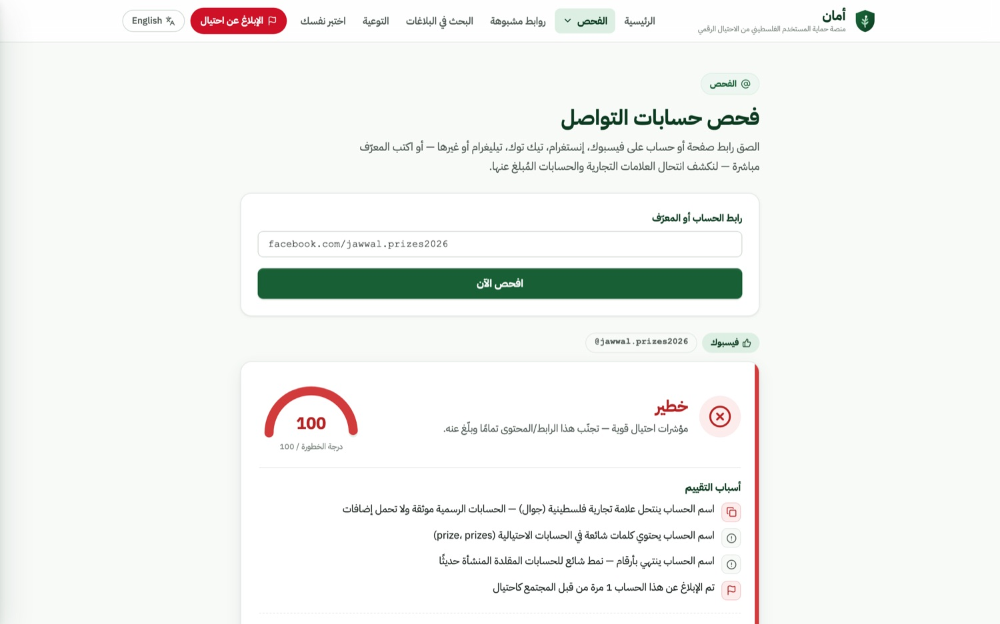
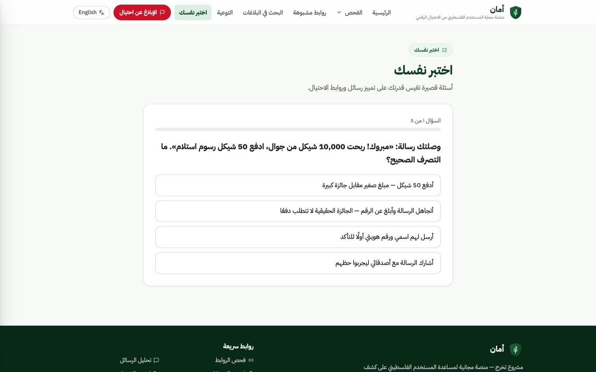
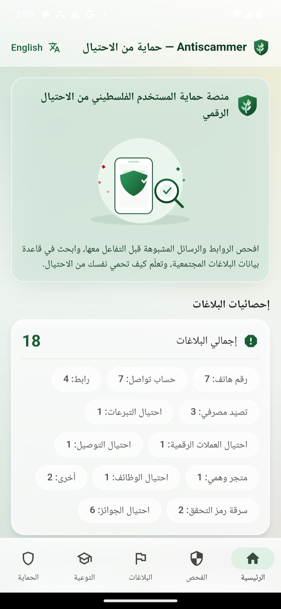
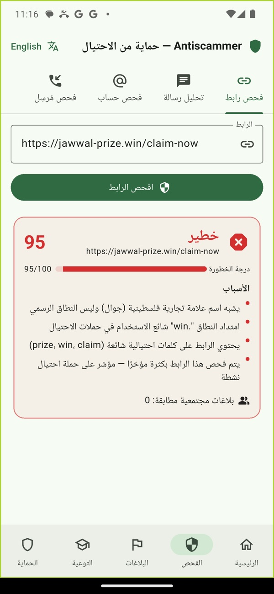
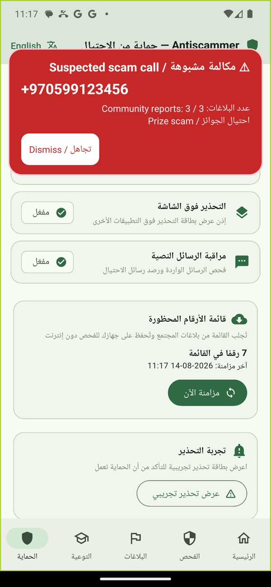
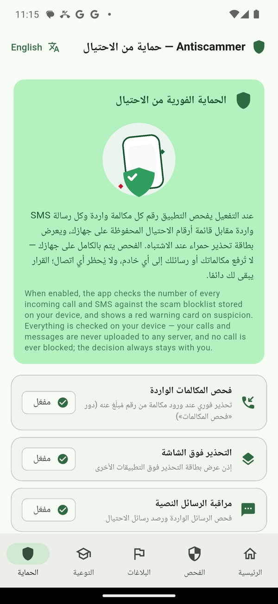

# أمان — Aman

**Palestinian User Protection Platform from Digital Fraud**
منصة حماية المستخدم الفلسطيني من الاحتيال الرقمي

Graduation project — a free, Arabic-first web and mobile platform that helps
Palestinian internet users check a suspicious link, message, social account, or
caller *before* acting on it, report scams they encounter, and learn to
recognize the fraud patterns that target them locally.

The full specification is in [`PROJECT_PLAN.md`](./PROJECT_PLAN.md); an
illustrated walkthrough is in [`docs/how-it-works.html`](./docs/how-it-works.html).

## What it does

| Feature | How it works |
|---|---|
| **URL checker** | Local heuristics — lookalikes of Palestinian brands (Jawwal, Ooredoo, Bank of Palestine, PalPay, Reflect…), punycode, IP hosts, suspicious TLDs, shorteners, missing HTTPS — plus community reports and a check-frequency signal |
| **Message analyzer** | Weighted Arabic/English scam-pattern engine (prize, delivery, job, bank phishing, OTP theft, urgency), sender-aware, with an optional local-LLM second opinion |
| **Social account checker** | Brand impersonation in handles (Levenshtein + substring), scam keywords, digit-suffix patterns, matching reports |
| **Sender / caller checker** | Curated registry of official Palestinian senders vs. community-reported numbers, with explicit spoofing warnings |
| **Community reports** | Users report scam numbers, URLs, and accounts; moderated before publication; searchable by anyone |
| **Awareness hub** | Bilingual articles and a quiz on the scams that target Palestinians |
| **Real-time protection** | Android: on-device screening of incoming calls and SMS against the synced blocklist, with a warning overlay. iOS is a platform limitation — see [§7b](./PROJECT_PLAN.md) |

Verdicts are color-coded (safe / suspicious / dangerous) with a 0–100 risk
score and reasons localized in Arabic and English.

## Screenshots

Real output from the running application, not mockups. Verdicts, scores and
reasons all come from the actual API against seeded data.

<table>
  <tr>
    <td width="50%">
      
      <sub><b>URL checker.</b> A lookalike of a Palestinian brand, scored out of 100 with every reason listed.</sub>
    </td>
    <td width="50%">
      
      <sub><b>Sender and caller.</b> Official Palestinian senders against community reports, with spoofing warnings.</sub>
    </td>
  </tr>
  <tr>
    <td width="50%">
      
      <sub><b>Social accounts.</b> Brand impersonation in handles, scam keywords and digit-suffix patterns.</sub>
    </td>
    <td width="50%">
      
      <sub><b>Awareness hub.</b> Bilingual articles and a quiz on the scams that target Palestinians.</sub>
    </td>
  </tr>
</table>

### Mobile

<p align="center">
  
  
  
  
</p>

<sub>Left to right: home, a check result, the native Android warning overlay on an
incoming call, and the real-time protection settings.</sub>

The full set, including the moderation console and the English interface, is in
[`docs/screenshots/`](./docs/screenshots/).

## Layout

```
backend/   Express + TypeScript + Prisma  — the API and all detection engines
web/       React + Vite + TypeScript      — Arabic-first RTL web app
mobile/    Flutter + Android/Kotlin       — mobile app and real-time protection
docs/      how-it-works explainer, screenshots
```

## Quick start

**Development** (SQLite, no external services):

```bash
cd backend && npm install && npx prisma migrate dev && npm run seed
ADMIN_TOKEN=$(openssl rand -hex 24) npm run dev     # :3000

cd ../web && npm install && npm run dev             # :5173

cd ../mobile && flutter pub get && flutter run
```

**Production-shaped stack** (Docker + PostgreSQL + nginx):

```bash
cp .env.docker.example .env     # set POSTGRES_PASSWORD and ADMIN_TOKEN
docker compose up --build       # web on :8080, moderation at /admin
```

## Tests

```bash
cd backend && npm test     # 85 — analyzers, normalization, blocklist, moderation
cd web     && npm test     # 52 — API client, i18n, verdicts, admin flow
cd mobile  && flutter test # 14 — screens, models, protection tab (incl. iOS state)
```

## Moderation

Community reports are submitted as `PENDING`; only `APPROVED` ones become
public or reach the mobile blocklist. Approving happens in the console at
`/admin`, which is not linked from the site navigation and is guarded by the
backend's `ADMIN_TOKEN`. **Without that token set, the moderation API stays
disabled and no report can ever be published** — the Docker entrypoint warns
about this on start.

## A note on the results

Verdicts are produced by heuristics and pattern rules, not certainty. A "safe"
result means no known fraud indicator was found, not that something is
trustworthy. The UI says so in both languages.
